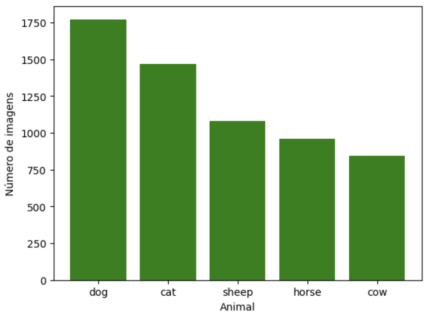
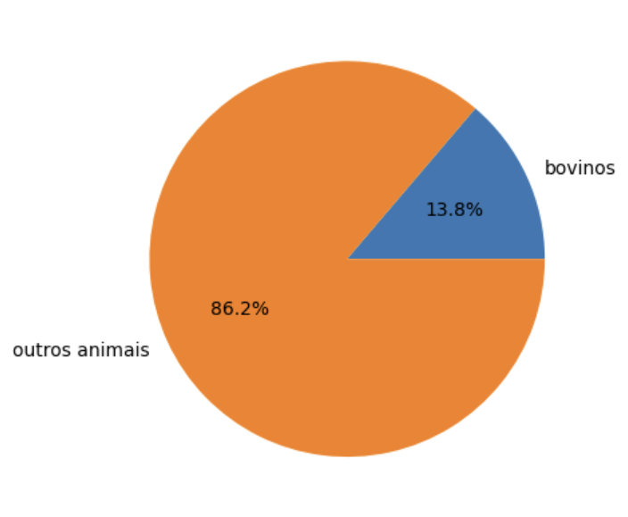
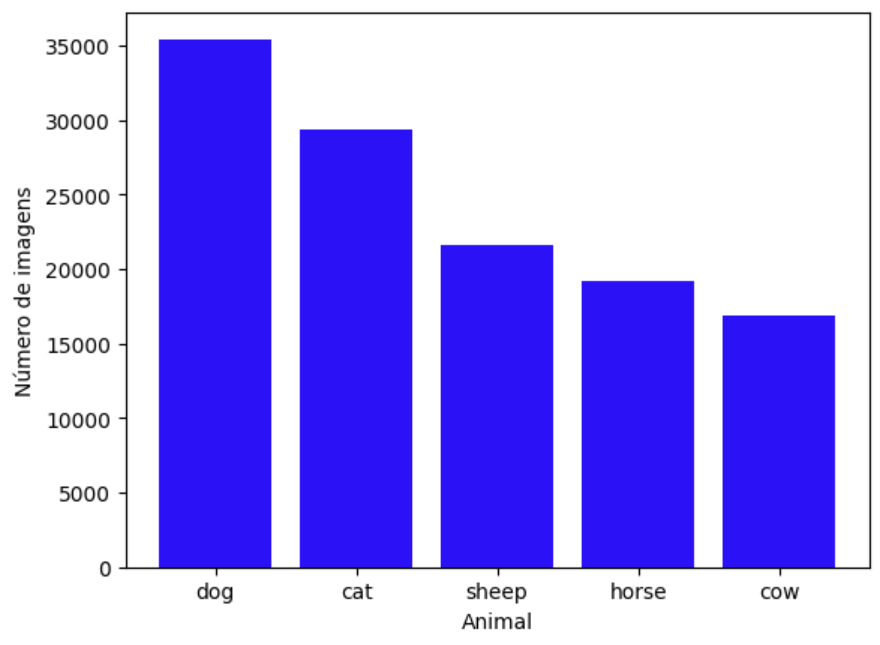
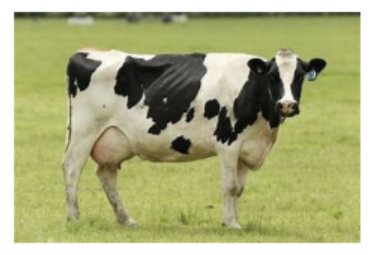
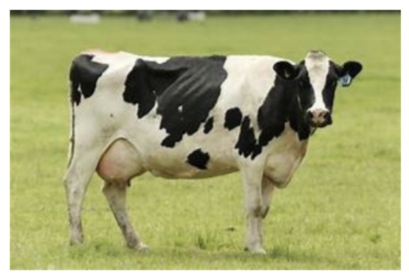
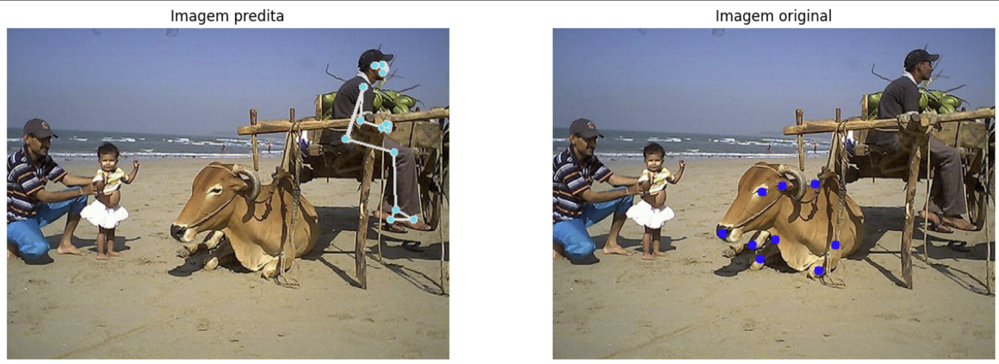
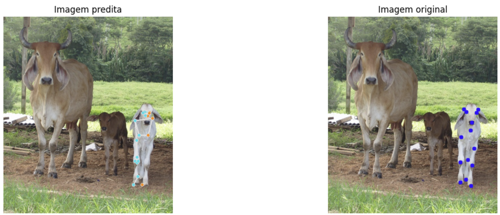
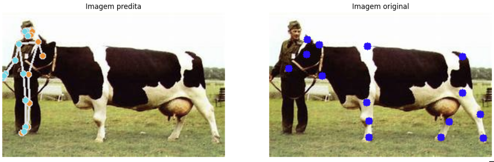

# Ponderada pose estimation bovinos - Marcelo Maia
 
## 1. Análise exploratória
O ANIMAL-POSE DATASET foi obtido nesse [site](https://www.kaggle.com/datasets/bloodaxe/animal-pose-dataset), e contém imagens de diversas espécies animais, incluindo bovinos.

Após o carregamento do dataset, foi realizada uma exploração das keys(['images', 'annotations', 'categories', 'info']) do dataset 
* images: dicionário que relaciona image_id com o nome da imagem
* annotations: dicionário com informações de cada imagem, como image_id, coordenadas da bouding box, coordenadas dos keypoints que formam a pose estimation do animal e category_id que informa a espécie do animal
* categories: informa a espécie de cada animal e seu category_id. Nota-se que o category_id dos bovinos é 5.
* info: descrição do dataset

Além disso, foi realizada uma análise exploratória para entender a distribuição das imagens por categoria animal e para destacar a quantidade de imagens referentes aos bovinos.

Através do gráfico percebe-se que a maior parte das imagens do dataset são de cachorros, enquanto que a minoria do dataset é representada por bovinos, contendo apenas 842 imagens.

Após essa constatação, foram plotadas algumas amostras do dataset, que serviram para aprofundar o conhecimento do dataset. Ademais, constatou-se que as 842 imagens de bovinos correspondem a aproximadamente 13% da composição do dataset.

Por fim, durante a exploração buscou-se também entender mais sobr a distribuição de keypoints por espécie, ou seja, entender como se comporta a variação de pose estimation para cada tipo de animal. Pórem, notou-se que todas as imagens e, consequentemente, todas as espécies possuem o mesmo número(20) de keypoints.

Nesse gráfico, observa-se o número de keypoints total por espécie animal, ao plotar esse gráfico pela primeira vez foi possível perceber que ele é muito semelhante ao gráfico de número de imagens por espécie animal. Aprofundando mais na exploração  dos keypoints, foi observado que todas as imagens possuem a mesma quantidade de keypoints(20).

## 2. Filtragem e Processamento do Dataset

Primeiramente , foi realizada uma filtragem para manter apenas as imagens de bovinos no dataset. Identificou-se que o category_id dos bovinos era "5", em seguida filtrou-se apenas os items em data['annotations'] que continham esse category_id, o resultado foram 842 annotations de bovinos.

Além disso, após a realização de uma análise no annotations de bovinos, foi possível perceber que haviam imagens repetidas, pois em muitos casos existia mais de um bovino na imagem, sendo assim a imagem aparecia mais de uma vez no annotations. Portanto, após filtrar no dataset de annotations bovinos, encontrou-se 534 imagens únicas no dataset.

Posteriormente foi realizado um processamento de imagem, que consistiu em realizar o redimensionamento destas, esse processamento é importante para garantir a uniformidade no tamanho das imagens, o que é muito valioso quando busca-se realizar o treinamento ou o transfer learning de modelos de redes neurais, ainda que esse não seja o caso é muito interessante garantir que as imagens possuam as mesmas dimensões que são 480x480.

No exemplo de processamento realizado acima observa-se respectivamente a imagem original e a imagem após o redimensionamento.

## 3. Resultados finais do processamento

Para a realização do pose estimation foi utilizado o modelo MediaPipe Pose, um modelo de pose estimation de alta precisão e que utilizar deep learning para realizar a predição, esse modelo é focado em pose estimation para humanos, o que representou um certo desafio ao buscar utilizá-lo para um dataset com bovinos.

Foram inputadas 100 imagens aleatórias do dataset de bovinos para a realização da inferência pelo modelo, porém apenas em 15 imagens o modelo conseguiu realizar alguma predição, como pode ser observado alguns exemplos de predições realizadas abaixo:

Nesse sentido, facilmente nota-se que o modelo não consegue realizar predições de bovinos com precisão, ao contrário de humanos, para os quais o modelo consegue ter uma alta precisão ao fazer o pose estimation.

O resultado final do modelo para a amostragem de 100 imagens do dataset bovino foi a seguinte tabela:

| Total de imagens | Imagens preditas | Bovinos preditos  | Humanos preditos |
| ------------- | ------------- | ------------- | ------------- |
| 100  | 15  | 6 | 8  |

Portanto, de 100 imagens de entrada apenas 15 o modelo conseguiu fazer uma predição, sendo apenas 6 de pose estimation para bovinos, enquanto 8 foram para humanos.

Também foi realizado, o input de todas as imagens dos bovinos, as imagens não foram plotadas pois o objetivo era entender a quantidade de predições que o modelo conseguiu realizar. A partir do input de 534 imagens únicas de bovinos o modelo conseguiu realizar apenas 58 predições, sendo algumas dessas apenas predições de seres humanos.

## 4. Conclusões

Antes da aula do professor, explorei outros modelos de estimativa de pose, como MMPose, OpenPose, YOLOv8 e até mesmo um [modelo](https://github.com/PaddlePaddle/PaddleDetection?tab=readme-ov-file#%EF%B8%8Fpp-tinypose-人体骨骼关键点识别) asiático, que apresentou certa dificuldade de compreensão.

No entanto, não obtive sucesso na predição de poses para bovinos com os modelos testados. Isso me levou a compreender a importância do transfer learning. Por mais avançada que seja a arquitetura e a performance de um modelo, ele não apresentará bons resultados se não tiver sido treinado com dados semelhantes ao tipo de entrada que você pretende usar. Sem um treinamento específico, mesmo modelos de alto desempenho não conseguem generalizar adequadamente para novas categorias de dados, como animais.

Além disso, essa experiência me proporcionou um aprendizado valioso sobre as arquiteturas de pose estimation e suas aplicações práticas no mercado. Ao pesquisar sobre outras abordagens, descobri que esses modelos também podem ser utilizados para monitoramento da saúde de bovinos. Por exemplo, o comportamento de um animal que passa muito tempo deitado ou com pouca movimentação pode ser um indicativo de problemas de saúde, como doenças ou lesões.

Por fim, o modelo que utilizei, apesar de ser preciso, rápido e com alta acurácia para predições envolvendo humanos, mostrou-se limitado para pose estimation em bovinos. Isso ocorre porque foi desenvolvido e treinado principalmente com dados de imagens humanas. Para que esse modelo seja eficaz no contexto de bovinos, seria necessário realizar transfer learning, utilizando imagens de bovinos para retreinar o modelo, garantindo que ele aprenda as características específicas dos bovinos.
